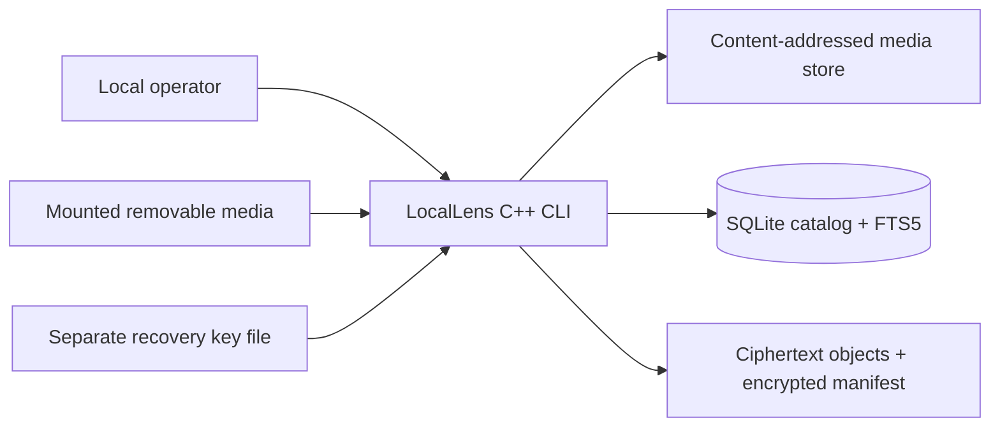
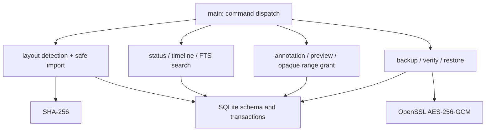
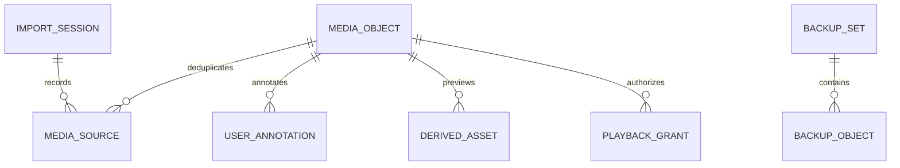
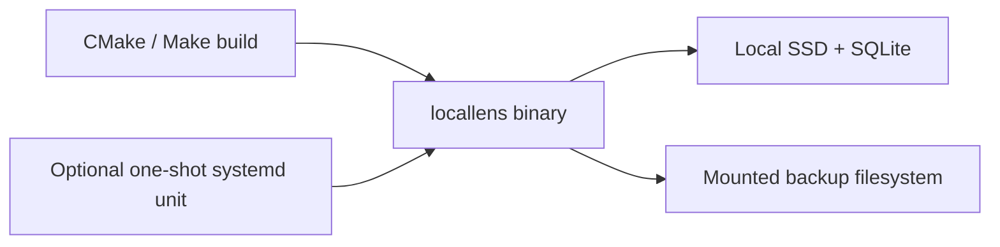

# Architecture review

Status: reviewed against the current local C++ ingestion, search, preview, and encrypted-backup implementation. Hardware and hosted-service behavior are not claimed.

## Context and containers



LocalLens is one local process. It imports removable-media files without modifying their source, stores bytes by SHA-256, records provenance and corrections in SQLite, and writes AES-256-GCM encrypted backup objects and manifests to a filesystem target. The "remote" target is an adapter boundary represented by a path, not a cloud-service claim.

## Components



All components currently live in `src/main.cpp`. The boundaries are command and data-flow boundaries, not invented libraries or services. Split the translation unit only when independent changes or test isolation become materially difficult.

## Data ownership



SQLite owns catalog metadata, provenance, audit, grants, backup manifests, and verification records. The filesystem owns immutable media bytes and encrypted backup objects. Hashes join the two responsibilities; user annotations never rewrite observations or source media.

## Current deployment



The evidenced deployment is a Linux-compatible local binary plus an optional hardened one-shot systemd unit. There is no daemon API, browser UI, cloud bucket, device discovery service, or Raspberry Pi hardware result yet.

## Critical import and failure sequence

```mermaid
sequenceDiagram
  participant O as Operator
  participant L as LocalLens
  participant C as Card
  participant S as Store
  participant D as SQLite
  O->>L: import mount-root store-root
  L->>C: detect supported layout and walk regular files
  L->>L: reject symlink escape; hash bytes
  L->>S: copy new object without changing source
  L->>D: record object, provenance, time confidence
  alt one file fails
    L->>D: record sanitized error
    L-->>O: quarantined event; continue session
  else import succeeds
    L-->>O: imported event
  end
  L->>D: close import session
  L-->>O: safe_eject_ready summary
```

```mermaid
sequenceDiagram
  participant O as Operator
  participant L as LocalLens
  participant R as Backup target
  participant D as SQLite
  O->>L: backup store target key
  L->>R: write authenticated encrypted objects + encrypted manifest
  L->>D: record hashes, sizes, nonce, tag
  O->>L: verify-backup manifest key
  L->>R: read ciphertext
  L->>L: authenticate, decrypt, hash plaintext
  alt wrong key, tamper, or mismatch
    L-->>O: fail verification; restore is not trusted
  else verified
    L->>D: record successful verification
  end
```

## Findings and limits

- Confirmed: content hashing deduplicates bytes while preserving every source provenance row.
- Confirmed: path canonicalization and symlink rejection protect the import/store boundary; opaque playback grants avoid exposing filesystem paths.
- Confirmed: recovery-key material is supplied separately and is not stored in the catalog or manifest.
- Confirmed: ciphertext names are immutable ciphertext hashes, so a newer backup cannot overwrite an older manifest's object; manifests are authenticated ciphertext and restore paths are constrained to an empty target.
- Limit: backup encrypts one complete object in memory. Add chunked streaming before using large real recordings; the current synthetic-fixture result is not a production-media throughput claim.
- Limit: the filesystem backup adapter has no network retry, credential, bucket-retention, or multipart semantics. Add a provider adapter only after an actual target is selected.
- Limit: the one-shot systemd unit currently runs `status`; automated card detection/import is not implemented.
- Limit: the single-process design serializes work. Revisit only after device measurements show import latency or concurrency is unacceptable.

See the [decision records](adr/README.md) and [threat model](threat-model.md).
